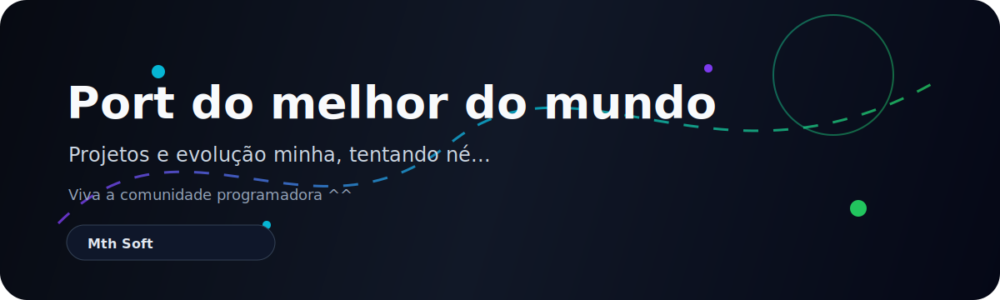

<div align="center">



# Portfólio de Desenvolvimento

**Um repositório vivo, eu acho**

</div>

---

## Visão geral

Este repositório foi criado para ser um **portfólio no GitHub**.

Divirta-se dando uma olhada no meu portfólio.

> vai melhorar com o tempo, prometo

---

## Identidade

**Nome profissional:** `[Mth Soft]`  
**Cargo em construção:** `[Ex: Desenvolvedor Back-end | Roblox Scripter | por enquanto...]`  
**Frase principal:** `Transformo estudo em entrega real, organizando cada etapa da minha evolução em projetos claros, testáveis e bem documentados.`

---

## Destaques

- Estrutura separada por área de conhecimento.
- READMEs em cada projeto para não deixar você cego no meu portfólio.
- Áreas restritas para JavaScript, TypeScript e SQL.
- Organização pensada para projetos futuros.


---

## Áreas do portfólio

| Área | Status | Descrição |
|---|---:|---|
| [HTML](./areas/html) | Público | Estrutura, semântica, acessibilidade e páginas. |
| [JavaScript](./areas/javascript) | Restrito | Interações, lógica e automações sem expor código sensível. |
| [TypeScript](./areas/typescript) | Restrito | Tipagem, organização e projetos mais escaláveis. |
| [Lua / Luau](./areas/lua) | Público | Scripts, sistemas Roblox e lógica server-side. |
| [Python](./areas/python) | Público | Automações, ferramentas, APIs e scripts. |
| [Redes Sociais](./areas/redes-sociais) | Público | Presença digital, posts e conteúdos técnicos. |
| [SQL](./areas/sql) | Restrito | Modelagem e consultas sem expor dados privados. |
| [Outros](./areas/outros) | Público | Experimentos e ideias fora das categorias principais. |

---

## Animação do repositório


O GitHub não executa JavaScript dentro do README, então as animações foram feitas com **SVG animado**, que funciona melhor em README de repositório, e sim, deixo pegar 🫴.


## Estrutura

```txt
.
├── .github/
├── areas/
│   ├── html/
│   ├── javascript/
│   ├── typescript/
│   ├── lua/
│   ├── python/
│   ├── redes-sociais/
│   ├── sql/
│   └── outros/
├── assets/
│   ├── animations/
│   ├── badges/
│   ├── icons/
│   ├── images/
│   └── videos/
├── docs/
├── .env.example
├── .gitignore
├── LICENSE
├── PRIVATE_AREAS.md
├── ROADMAP.md
├── SECURITY.md
└── README.md
```

---

## Contato

- Discord: `[mth_2009rr]`
- Email: `[studiosyank@gmail.com]`
- Portfólio/site: `[tem não, ainda não...]`

---

<div align="center">


**Repositório feio.**

</div>
